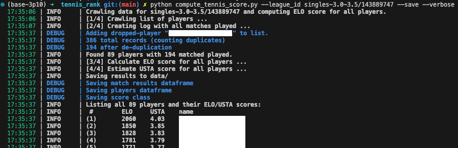

# tennis_rank
> Stefano Nov 2023

The script `compute_tennis_score.py` performs the following tasks:
- Crawl tennisrungs for the specified league (no API key necessary)
- Parse all results
- Compute the [ELO score](https://en.wikipedia.org/wiki/Elo_rating_system)
- Estimate a [USTA score](https://www.usta.com/en/home/play/adult-tennis/programs/national/usta-ntrp-ratings-faqs.html) (also known as NTRP)


For the latter estimation, the following steps/assumptions are followed:

- Assume each group is distributed normally and centered to the USTA range; eg, the average player in the 3.0-3.5 group has a USTA score of 3.25.
- Assume that at the end of the tournament, top 5% will move up, bottom 5% will move down (actual numbers may vary, this is just for a completely filled in distribution)
- The rest is just math to shift from ELO to USTA score distribution
- Finally, apply a compression to ensure that all values are at best +/- 0.5 USTA levels from the range limits; eg for 3.0-3.5 group, no score smaller than 2.5 or greater than 4.0 is generated. This compression is a power of 10. 

## Run

```
python compute_tennis_score.py --league_id singles-3.0-3.5/143889747 --save --verbose
```

## Install

```
pip install -r requirements.txt
```


## Output
